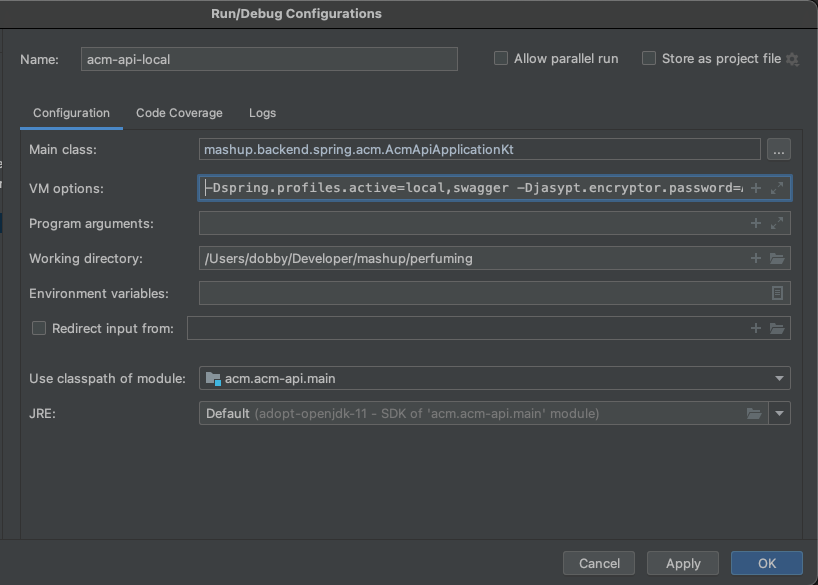

# ACM-backend
> 매쉬업 11기 앱최몇 팀 백엔드 repository 입니다. 

## Getting Started

### Prerequisites
- JDK 11
- Intellij IDEA
- 암호화키 (팀원에게 물어보기)

### Installation

#### 1. Download project
```bash
git clone https://github.com/mash-up-kr/ACM-Backend.git
```

#### 2. Run
##### Gradle wrapper
```bash
./gradlew :acm-api:bootRun --args='--spring.profiles.active=local,swagger --jasypt.encryptor.password={암호화키}'
```
##### Intellij
